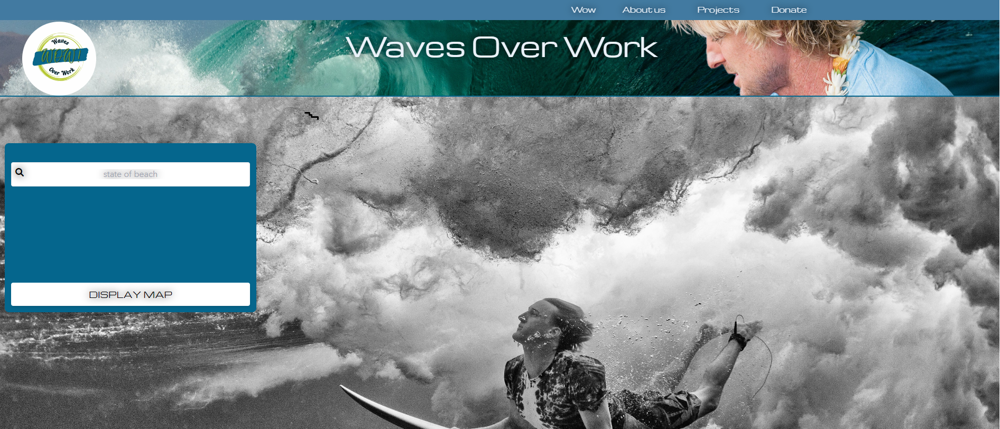

# Perfect Beach Day

## Description

This website was created by four aspiring full-stack developers attending the University of Central Florida's coding bootcamp. This assignment required us to pull in at least two server-side APIs in order to fetch data to be displayed to our users. Our application presents surfer-specific weather conditions depending on a location. 

User-desired input is given and a current weather forecast, five-day forecast and geographical location on a map are all presented to the page. Additional links for water levels, reports, tide predictions and benchmarks are also included. 

We learned a lot while developing this website. We learned how to use a different CSS framework besides Bootstrap called Tailwind. We also learned how to fetch data from multiple APIs and adapting to multiple roadblocks along the way to developing a professional and functional web applilcation. 

Most importantly, we learned how to collaborate with other developers to take what started out as just an idea for a website from our head and work together to deploy a web application made from scratch. We learned how to navigate effectively to make changes on our project via GitHub and were re-humbled about the crucial importance of communication and teamwork. In conclusion, we incorporated a fun, Owen Wilson theme to our website to keep us laughing and engaged while increasing user-satisfaction. 

## User Story

AS A surfer
I WANT to be able to view the weather conditions based on different locations
SO THAT I can figure out where and when the optimal surfing conditions are going to occur

## Usage

Once deployed, the application can be viewed in a traditional desktop web browser. It is also optimized for laptop, tablet, and smartphone.

## Credits

Collaborators on this project included instructional staff, TAs, and students from University of Central Florida.

Jessica Almand, Maria Constanza, Mary Elenus, and Taber Youmans

A special thanks to my daughter, Yennefer. Every day she proves she is small but mighty!

## References and tutorials utilized
<!-- Remove any pre-filled resources not used in building of project -->
<!-- Add to list using the following format: -->
<!-- * Source Subject: [Source] (https://www.sourceLink.com/) -->
* Javascript: [W3 Schools](https://www.w3schools.com/js/js_intro.asp/)
* Markdown: [Markdown Guide](https://www.markdownguide.org/basic-syntax/)
* CSS: [W3 Schools](https://www.w3schools.com/cssref/)
* Reset: [Eric Meyer reset](https://meyerweb.com/eric/tools/css/reset/)
* Tailwind CSS: [Tailwind](https://tailwindcss.com/)
* HTML: [W3 Schools](https://www.w3schools.com/html/)

## Links
<!-- Add links using the following format: -->
<!-- * Link subject: [Link title](https://www.link.com/) -->

* Deployed site: [Live Site-Waves Over Work](https://mariayconstanza.github.io/beach-day/)
* Github repo: [Github-MariaYConstanza](https://github.com/MariaYConstanza/beach-day)

## Screenshots
<!-- Add screenshots using the following format: -->
<!--  -->

## License

MIT License

Copyright (c) [2022] yourlocationNameHere

Permission is hereby granted, free of charge, to any person obtaining a copy
of this software and associated documentation files (the "Software"), to deal
in the Software without restriction, including without limitation the rights
to use, copy, modify, merge, publish, distribute, sublicense, and/or sell
copies of the Software, and to permit persons to whom the Software is
furnished to do so, subject to the following conditions:

The above copyright notice and this permission notice shall be included in all
copies or substantial portions of the Software.

THE SOFTWARE IS PROVIDED "AS IS", WITHOUT WARRANTY OF ANY KIND, EXPRESS OR
IMPLIED, INCLUDING BUT NOT LIMITED TO THE WARRANTIES OF MERCHANTABILITY,
FITNESS FOR A PARTICULAR PURPOSE AND NONINFRINGEMENT. IN NO EVENT SHALL THE
AUTHORS OR COPYRIGHT HOLDERS BE LIABLE FOR ANY CLAIM, DAMAGES OR OTHER
LIABILITY, WHETHER IN AN ACTION OF CONTRACT, TORT OR OTHERWISE, ARISING FROM,
OUT OF OR IN CONNECTION WITH THE SOFTWARE OR THE USE OR OTHER DEALINGS IN THE
SOFTWARE.
